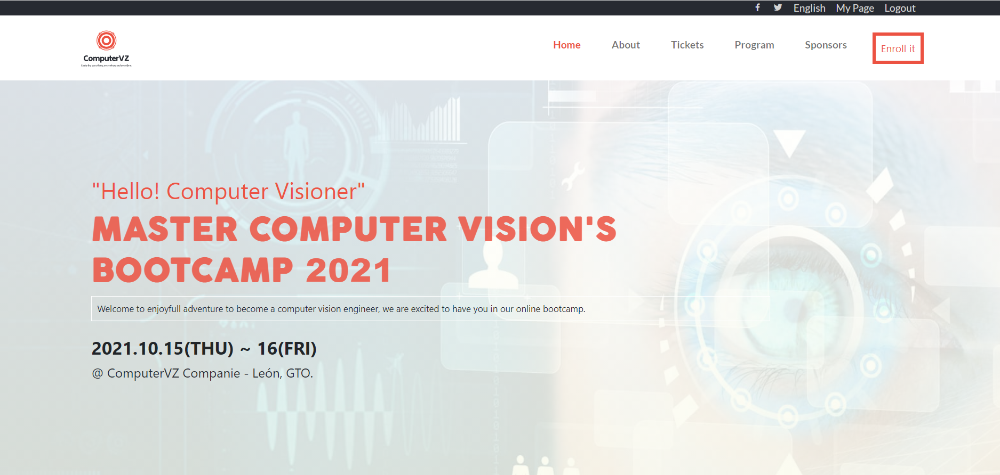
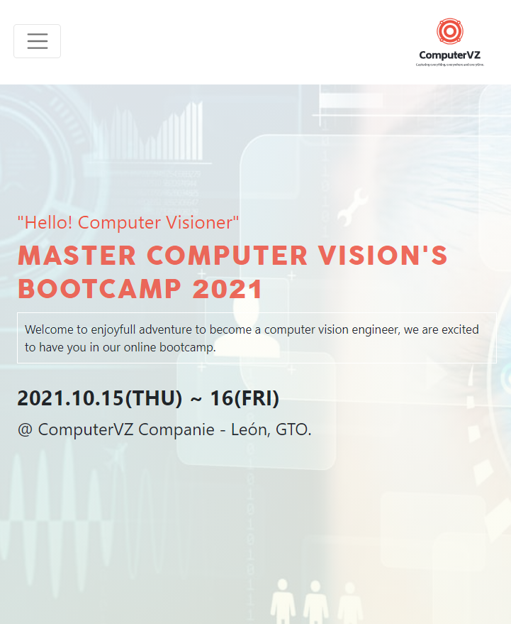

# Online Course (Computer Vision) Website

> This project is the final capstone for the first module (HTML - CSS).

The next website is about a Master Bootcamp about Computer Vision, it's just an instance according to the website to sell a software course.
For this project, I've used HTML, CSS, and Bootstrap to the entire website, also I've included GRID and flexbox to make more professional distribution of elements inside specific parts of the website.

## Desktop 💻

## Mobile 📱

I've used 1 breakpoint only, for this reason, the website is responsive for mobile and desktop layouts.

## Built With 🔨

- HTML5
- CSS
- Bootstrap
- Visual Studio Code
- Git & Github

## Live Demo 👀

[Live Demo Link](https://dantealonsoht.github.io/OnlineCourse-FInalCapstone/#)

### Install

To get a local copy up and running follow these simple example steps.
- Open terminal
- Clone this project by command git clone https://github.com/DanteAlonsoHT/OnlineCourse-FInalCapstone.git
- Cd perma-clone folder
- Open index.html in the browser

## Getting Started 

- In index.html file is the main makeup that will show as the first page in the browser.
- In the css folder, you will find the CSS file that contains all applicated designs on this project.
- Img folder contains most of the pictures that have been in use for this project

### Prerequisites

- IDE to edit and run the code (I used Visual Studio Code 🔥).

### Usage

- For anyone who wants to practice HTML5, CSS, and Bootstrap responsive design.
- How to apply responsive design using flexbox and GRID.
- How to use only one breakpoint to make a responsive website.

## Author

👤 **Dante Alonso Hernández Tapia**

- GitHub: [@DanteAlonsoHT](https://github.com/DanteAlonsoHT)
- Twitter: [@dante_dante1](https://twitter.com/dante_dante1)
- LinkedIn: [Dante Alonso](https://www.linkedin.com/in/dante-hernandez99/)

## 🤝 Contributing

Contributions, issues, and feature requests are welcome!

Feel free to check the [issues page](https://github.com/DanteAlonsoHT/OnlineCourse-FInalCapstone/issues).

## Show your support

Give a ⭐️ if you like this project!

## Acknowledgments

- Hat tip to anyone who's code was used 🔰
- Inspiration 💘
- Microverse program ⚡
- My standup team 🏹
- 
Design idea by <a href="https://www.behance.net/adagio07">Cindy Shin | GUI & Graphic Designer</a> 

## 📝 License

This project is [MIT](./mit.md) licensed.
